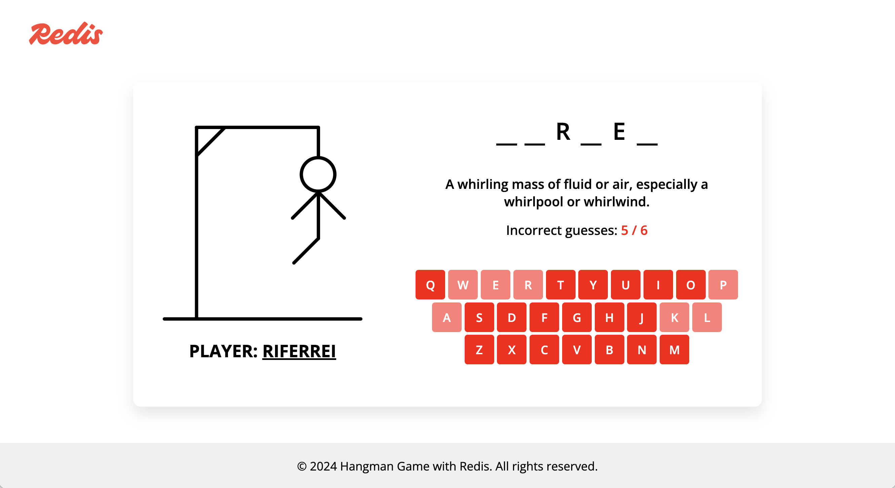
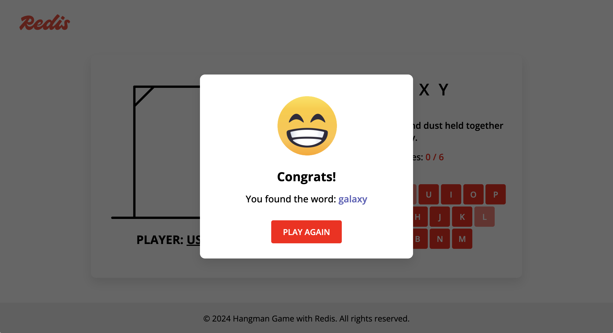

# Hangman Game with Redis

Hangman is a popular game of guessing. One player thinks of a word, and then provides the participants with a hint about the word, as well as how many letters it contains. It was super fun at school during recess times. But guess what? It can still be fun if you play against a machine and collaboratively with your friends. Meet Hangman game with Redis.



This is the Hangman game written in JavaScript for the frontend, and uses [Java](https://openjdk.org) and [Redis](https://redis.io) for the backend. Once deployed, multiple users can play simultaneously, while a real-time scoreboard is computed based on the plays.

## 🏠 Deploying locally

To deploy this game locally, you will need to have the following pre-requisites:

* **[Docker](https://www.docker.com)**: to pull images and create the containers with the services.

### Steps

#### 1. Executing the services

Go to the root directory from this project where the file `docker-compose.yml` is located and execute the following command:

```bash
docker compose up -d
```

Once the services finish starting up, you can access the game in the following URL:

http://localhost:8080/hangman-game-redis

To stop the services, execute the following command:

```bash
docker compose down
```

## ☁️ Deploying on AWS

To deploy this game on AWS, you will need to have the following pre-requisites:

* **[Java 17](https://openjdk.org)**: to compile and build Lambda functions and backend APIs.
* **[Maven](https://maven.apache.org/download.cgi)**: to build the project and create the deployment archive.
* **[Terraform](https://developer.hashicorp.com/terraform/install)**: to create all the resources and required configuration.
* **[Redis Cloud](https://redis.io/cloud/)**: for the Redis database to store the game data. 
* **[AWS Account](https://portal.aws.amazon.com/billing/signup)**: for resources like S3, Lambda, and API Gateway.

### Steps

#### 1. Defining your Redis Cloud account

During deployment, the code will create a new subscription and database in your Redis Cloud account. By default, the subscription will be based on the [30 MB Essentials plan](https://redis.io/docs/latest/operate/rc/subscriptions/view-essentials-subscription/essentials-plan-details/), which is free. This allows you to play with the game without paying a single dime to Redis. If you are wondering whether a `30MB` database size will suffice for you to play the game with thousands of users simultaneously, the answer is yes. In fact, this plan allows you to handle `500,000` users approximately. For anything beyond this, consider a plan with a larger capacity.

In order for the code to create these resources, it needs to know how to interact with your Redis Cloud account. Therefore, you must export valid API keys from your Redis Cloud account as environment variables before moving further. You can find instructions about how to create your own API keys [here](https://redis.io/docs/latest/operate/rc/api/get-started/manage-api-keys). Then export the following environment variables:

```bash
export REDISCLOUD_ACCESS_KEY=<YOUR_REDISCLOUD_ACCESS_KEY>
export REDISCLOUD_SECRET_KEY=<YOUR_REDISCLOUD_SECRET_KEY>
```

#### 2. Execute the deployment

To deploy the game, go to the `cloud` directory, and execute the following command:

```bash
sh deploy.sh
```

This will start with the compilation of the source-code and the download of the dependencies from Terraform. Keep in mind that in order for the Terraform code to create cloud resources, your AWS credentials must be already set in your environment.

From this point on, Terraform will start the deployment of the game on AWS. It may take a few minutes to complete. When it finishes, you will see an output like this:

```bash
Apply complete! Resources: 94 added, 0 changed, 0 destroyed.

Outputs:

Game = "http://hangman-game-redis-uniquestring.s3-website-us-east-1.amazonaws.com"
```

This is the URL of the game. Share this URL with everybody wanting to play. To undeploy the game and delete the resources created, go to the `cloud` directory, and execute the following command:

```bash
sh undeploy.sh
```

## 🚀 Playing the game

The first thing you will see after opening the game is a text box asking you to specify your player's name. This is a required step. Your name is required to compute the scoreboard.


At any time, you can set the player name again by pressing **Shift** + **P**. To close the set player name window, press the **ESC** key.

After confirming your name, the game begins. The game is self-explanatory. All you have to do is read the hint provided, and try to guess what word is being asked. Use your mouse or your keyboard to select the characters representing the letter from your guess. If you enter a wrong letter, the hangman will start to build. You have 6 guesses per game. If you find the word, congratulations. A new point will be added to your score. Otherwise, your score will not add up.



Whether you win or lose, you will always be presented with the option to play again. Just click in the play again button and try one more time. A new word will be picked to you.

To see the scoreboard, press **Shift** + **S**.


To close the scoreboard window, press the **ESC** key.

The game also makes available some interesting metrics about the plays from users. To see the metrics, press **Shift** + **M**.


To close the metrics window, press the **ESC** key.

## License

Hangman Game with Redis is licensed under the **[MIT license](LICENSE)**.
